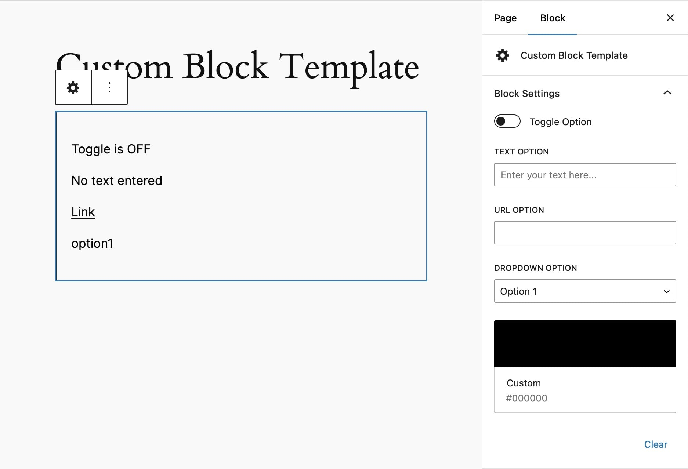

# Custom Block Template

| **Description**       | Template for a basic custom WordPress block with no build tools needed               |
| --------------------- | ------------------------------------------------------------------------------------ |
| **Contributors**      | contributorhandle                                                                    |
| **Donate link**       | [https://david.garden/plugins](https://david.garden/plugins)                         |
| **Tags**              | block, Gutenberg                                                                     |
| **Requires at least** | 5.0                                                                                  |
| **Tested up to**      | 6.6                                                                                  |
| **Requires PHP**      | 7.0                                                                                  |
| **Stable tag**        | 1.0.0                                                                                |
| **License**           | GPLv3 or later                                                                       |
| **License URI**       | [http://www.gnu.org/licenses/gpl-3.0.html](http://www.gnu.org/licenses/gpl-3.0.html) |

## Description

This is a custom block template that includes a sample toggle, text field, URL input, dropdown selection, and color picker.

## Features

- **Toggle Field** - boolean true/false toggle
- **Text Input** - custom text input
- **URL Input** - custom URL input
- **Dropdown** - Dropdown option selector
- **Color Picker** - Custom color picker

## Installation

1. Upload the `custom-block-template` directory to the `/wp-content/plugins/` directory.
2. Activate the plugin through the 'Plugins' menu in WordPress.
3. Ensure you have the latest version of WordPress installed (minimum version 5.0).

## Screenshots

**Backend Display**: How the block appears on the backend.

**Frontend Display**: How the block appears on the frontend.

## Changelog

### 1.0
* Initial release of the Custom Block Template plugin.

## Todos

Planned upgrades to the plugin include:

- Range Control
- Radio Control
- Checkbox Controls
- Date Time Picker
- Textarea Control
- Toggle Group Control
- Media Upload
- Alignment Toolbar
- RichText

---

I am not affiliated with Automattic and the WordPress Foundation. I fully disagree with the public actions taken by Matt Mullenweg, and what he is doing through his ownership of Automattic, the WordPress Foundation, and wordpress.org.
